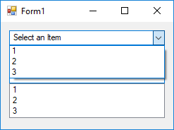
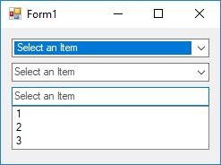

# Set Cue Banner or Hint for ComboBox

The example shows how to set a hint for a combo box. It also known as tip, watermark and cue banner.

To do so, if the ComboBox has DropDown or Simple mode, you can send a [`CB_SETCUEBANNER`](https://msdn.microsoft.com/en-us/library/windows/desktop/bb775897.aspx) message to its inner edit control to set hint. If the combo has DropDownListMode, set it to owner draw to draw hint.

